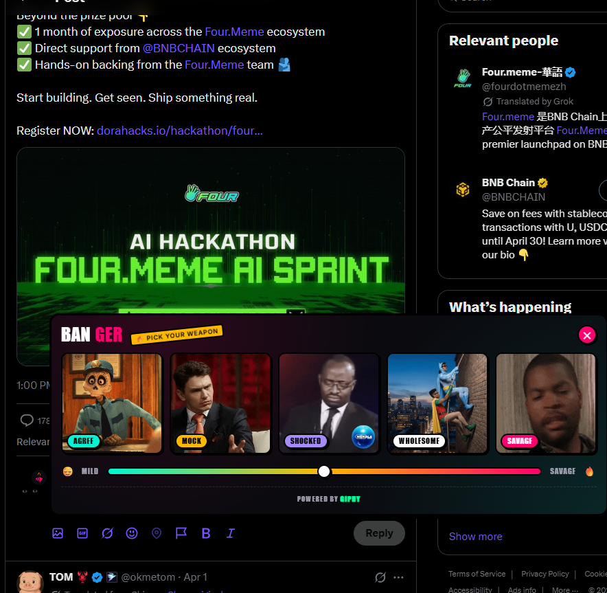
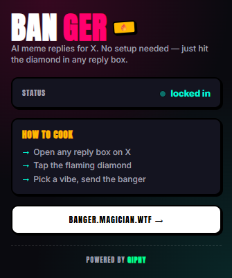

<div align="center">

# Banger 🔥

**AI-powered meme replies for X.**

A Chrome extension that reads the tweet you're replying to, figures out five different ways you could react, and attaches the perfect GIF in one click.

[](LICENSE)


<br/>



</div>

---

## 📥 Install the extension

### Option 1 — Download the latest release *(recommended)*

1. Head to the **[Releases page](https://github.com/Magicianhax/banger/releases)**
2. Download `banger-extension.zip` from the latest release
3. Unzip it anywhere on your computer
4. Open `chrome://extensions` in Chrome
5. Toggle **Developer mode** (top-right)
6. Click **Load unpacked** → select the unzipped folder
7. Pin the flaming diamond icon to your toolbar

### Option 2 — Build from source

See [§ Getting started](#-getting-started) below for the full dev setup.

> Chrome Web Store listing coming soon.

<br/>



Once installed, click the flaming diamond badge on your avatar when replying to any tweet on X. Pick a vibe, and the GIF attaches as a native media upload (not a raw link). That's it.

<br clear="all" />

---

## ✨ Features

- **5 vibe slots per reply** — agree / mock / shocked / wholesome / savage. One perfect GIF each, picked by GPT-5.
- **Intensity slider** — calibrate mild ↔ savage in real time without extra API calls.
- **Subculture-aware** — auto-detects if the tweet is tech, crypto, anime, sports, music, politics, gaming, film/tv, or football, and biases picks accordingly.
- **Read-the-room safety gate** — AI flags tweets about grief/news/violence and refuses to suggest memes unless explicitly overridden.
- **Native GIF attachment** — the GIF uploads through X's own media pipeline (not a raw link paste), so it embeds as a proper tweet card.
- **Deep-fried sticker UI** — chunky Anton typography, hot-pink borders, offset hard shadows, shake-on-hover animations.
- **Open source, MIT licensed.**

---

## 🧠 How it works

```
Tweet ──▶ ANALYZE ──▶ RETRIEVE ──▶ RERANK ──▶ SLIDER ──▶ GIF
          (LLM)       (GIPHY)      (LLM)      (local)
```

Two LLM calls, one HTTP fan-out:

1. **Analyze** — GPT-5 Nano reads the tweet and returns, in a single structured-JSON call:
   - Intent (subject, emotional tone, subculture, per-slot reply guidance)
   - A `serious` flag for sensitivity gating
   - 3 search queries per vibe slot (emotion-first, not keyword-first)
2. **Retrieve** — the backend fans out to GIPHY, dedupes by URL, returns ~60–120 candidates.
3. **Rerank** — a second LLM call scores every candidate against the tweet + intent, returning the top 3 per slot at mild/medium/intense intensities.
4. **Slider** — the local vibe slider picks which of the 3 to display, no extra API call.
5. **Insert** — the extension fetches the chosen GIF bytes and dispatches a synthetic `ClipboardEvent` with a `File` in the `DataTransfer`, triggering X's native media upload pipeline.

Full pipeline design lives in [`docs/2026-04-18-banger-design.md`](./docs/2026-04-18-banger-design.md) (if included).

---

## 📦 Monorepo structure

```
banger/
├── packages/
│   ├── shared/              # Zod schemas + types shared between apps
│   ├── backend/             # Next.js 16 App Router
│   │   ├── app/
│   │   │   ├── api/
│   │   │   │   ├── health/  # health probe
│   │   │   │   ├── search/  # GIPHY proxy
│   │   │   │   └── suggest/ # full suggestion pipeline
│   │   │   ├── app/         # Dashboard UI (Home, Humor Profile, Settings)
│   │   │   └── page.tsx     # marketing landing
│   │   └── lib/
│   │       └── pipeline/    # analyze, retrieve, rerank, profile-weight, slider
│   └── extension/           # MV3 Chrome extension (Vite + CRXJS)
│       └── src/
│           ├── content/     # DOM detector + button injector + popover mount
│           ├── popover/     # React UI shown inside x.com
│           ├── popup/       # Browser-action popup
│           ├── service-worker/
│           └── lib/
└── package.json             # pnpm workspace root
```

---

## 🚀 Getting started

### Prerequisites

- Node.js ≥ 20
- pnpm ≥ 9 (`npm i -g pnpm@9`)
- An **OpenAI API key** (GPT-5 Nano recommended — cheap + fast)
- A **GIPHY API key** ([get one free](https://developers.giphy.com/dashboard))

### 1. Clone and install

```bash
git clone https://github.com/YOUR_USERNAME/banger.git
cd banger
pnpm install
```

### 2. Configure the backend

Create `packages/backend/.env.local`:

```env
OPENAI_API_KEY=sk-proj-...
GIPHY_API_KEY=...

# Optional — defaults shown
# LLM_PROVIDER=openai
# LLM_MODEL=gpt-5-nano
```

### 3. Run everything

```bash
# Terminal 1 — backend
pnpm --filter @banger/backend dev

# Terminal 2 — extension (builds to packages/extension/dist, watch mode)
pnpm --filter @banger/extension dev
```

### 4. Load the extension in Chrome

1. Open `chrome://extensions`
2. Enable **Developer mode** (top right)
3. Click **Load unpacked**
4. Select `packages/extension/dist`
5. Pin the Banger icon for easy access

### 5. Try it

1. Go to `x.com`
2. Click **Reply** on any tweet
3. The flaming diamond badge appears at the top-right of your avatar
4. Click it → pick a vibe → GIF attaches to your reply

---

## 🧪 Testing

```bash
pnpm test          # all packages
pnpm typecheck     # TypeScript across the monorepo
pnpm build         # production build of all packages
```

Each package also has its own filtered commands:

```bash
pnpm --filter @banger/backend test
pnpm --filter @banger/extension test
pnpm --filter @banger/shared test
```

---

## 🏗️ Architecture

**Backend** (Next.js 16 App Router, Vercel Fluid Compute compatible):

- `/api/health` — liveness probe
- `/api/search` — GIPHY/Tenor proxy with rate limiting
- `/api/suggest` — full 5-stage suggestion pipeline
- `/app/*` — dashboard (static marketing + dashboard routes)

**Extension** (MV3 Chrome extension, built with Vite + CRXJS):

- Content script detects X reply composers via MutationObserver
- Service worker orchestrates messaging + delegates pipeline to backend
- Popover renders inside a shadow DOM inside x.com (so our CSS doesn't leak)
- GIF insertion uses synthetic `ClipboardEvent` with a `File` to trigger X's native media upload

**Privacy:**

- No analytics, no telemetry, no tracking
- Tweet context is sent only to the configured LLM provider (e.g. OpenAI) for suggestion generation; the backend does not log it
- Humor profile settings save to `localStorage` (dashboard) and `chrome.storage.local` (extension) — never synced to our servers

---

## 🗺️ Roadmap

- [x] Core 5-slot vibe suggestions
- [x] GPT-5 Nano analyze + rerank pipeline
- [x] Native GIF attachment (not URL paste)
- [x] Read-the-room sensitivity gate
- [x] Deep-fried sticker UI
- [x] Humor profile dashboard
- [ ] Extension ↔ dashboard settings sync (via content script on our domain)
- [ ] Reply history + stats page
- [ ] Tweet-hash response caching (server-side)
- [ ] Streaming slot responses (SSE) — first GIF in ~600ms instead of ~9s
- [ ] Community meme packs + karma system
- [ ] Generative fallback (Flux for custom memes when GIPHY falls short)
- [ ] Chrome Web Store publication
- [ ] Multi-platform: Reddit, Discord, Instagram

---

## 🛠️ Tech stack

- **TypeScript** everywhere
- **Next.js 16** App Router + Turbopack
- **Vercel AI SDK 6** with `@ai-sdk/openai`
- **Zod** for end-to-end schema validation
- **React 19** for both the popover and the dashboard
- **Vite 5 + CRXJS** for the extension build
- **Vitest** for unit tests
- **pnpm workspaces** for the monorepo

---

## 🤝 Contributing

PRs welcome. Please:

1. Fork, branch from `main`
2. Run `pnpm typecheck && pnpm test` before pushing
3. Keep commits conventional (`feat:`, `fix:`, `perf:`, `docs:`, etc.)
4. For UI changes, match the existing sticker design language (Anton display, chunky borders, offset shadows)

Issues and discussions are open for feature requests.

---

## 📄 License

MIT — see [LICENSE](./LICENSE).

Built with [GIPHY](https://giphy.com). No affiliation with X Corp.

---

<div align="center">

Made with 🔥 by the Banger contributors.

</div>
